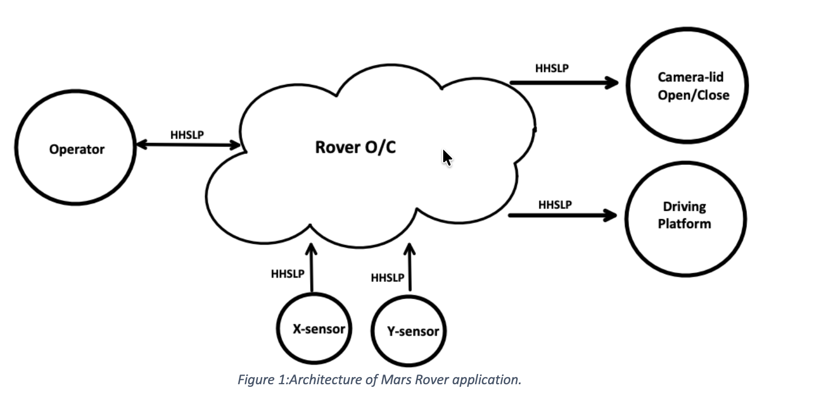

# Mars Rover System Requirement Specification (SRS)

This project presents the system design and requirement specification for a Mars Rover application developed as part of an academic course in Advanced Embedded Software Design.

## Project Overview

The goal of this project was to define a structured system for a Mars Rover capable of operating autonomously in challenging environments. The rover is designed to receive commands from an operator, execute actions, and send telemetry data back.

The project focuses on system-level planning, requirement definition, and structured documentation.

## My Contribution

- Developed and documented the **System Requirement Specification (SRS)**
- Defined **functional and non-functional requirements** for rover operations
- Participated in **team discussions and project planning**
- Contributed to the design of the **system architecture and communication flow**
- Maintained structured documentation to ensure **clarity and traceability**

## System Architecture

The following diagram illustrates the overall system architecture of the Mars Rover application, including communication between operator, onboard computer, and system components.



## System Block Diagram

For the block diagram image, here's improved alt text:

```markdown

```

## System Highlights

- Defined **input/output communication structure** between rover and operator
- Designed logic for:
  - Engine control
  - Camera lid behavior
  - Danger zone detection
- Specified **sensor-based positioning system (X/Y sensors)**
- Implemented structured **command and telemetry system**

## Repository Structure

- `docs/` → System Requirement Specification document

## Skills Demonstrated

- Requirement Engineering
- Technical Documentation
- System Design Thinking
- Team Collaboration
- Analytical Problem Solving

## Tools & Technologies

- SCADE (system design)
- Embedded system concepts
- Documentation tools

## Learning Outcomes

Through this project, I improved my ability to:

- Write structured system requirements
- Analyze system behavior and constraints
- Work collaboratively in a team
- Translate ideas into formal technical documentation

## Note

This repository focuses on the documentation and design aspects of the project. It demonstrates system-level thinking and structured engineering practices.
